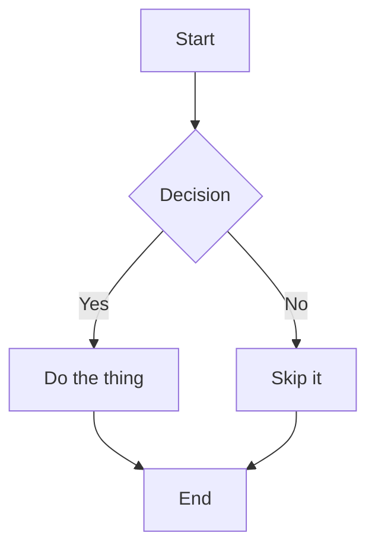

<p align="center">
  
</p>

<h1 align="center">Markdown PDF (Revived)</h1>

<p align="center">
  <a href="https://marketplace.visualstudio.com/items?itemName=AUAggy.markdown-pdf-revived"></a>
  <a href="https://open-vsx.org/extension/AUAggy/markdown-pdf-revived"></a>
  <a href="https://github.com/AUAggy/markdown-pdf-revived/releases"></a>
  <a href="LICENSE.txt"></a>
</p>

<p align="center">
  <a href="#getting-started">Install</a> &bull;
  <a href="#features">Features</a> &bull;
  <a href="#settings">Settings</a> &bull;
  <a href="#requirements">Requirements</a> &bull;
  <a href="#upgrade-notes">Upgrade</a>
</p>

Converts Markdown files to PDF or HTML from within VSCode. All rendering is local, with no external servers or telemetry.

## Requirements

A stable Chrome, Chromium, or Microsoft Edge installation is required for PDF export. HTML export does not require a browser. The extension detects supported browsers automatically at standard installation paths on macOS, Linux, and Windows.

On WSL, install the browser inside the Linux distribution.

To use a non-standard browser binary:

```json
"markdown-pdf.executablePath": "/path/to/browser"
```

Restart VSCode after changing this setting.

## Getting Started

**VS Code users** can search for "Markdown PDF" in the Extensions panel or install from the [VS Code Marketplace](https://marketplace.visualstudio.com/items?itemName=AUAggy.markdown-pdf-revived).

**VSCodium users** should install from [Open VSX](https://open-vsx.org/extension/AUAggy/markdown-pdf-revived).

**Manual install:** Download the `.vsix` from the [latest GitHub release](https://github.com/AUAggy/markdown-pdf-revived/releases), then run `Extensions: Install from VSIX` from the command palette.

## Usage

### Command Palette

1. Open a Markdown file.
2. Press `F1` or `Ctrl+Shift+P`.
3. Type `export` and select a command:
   - `Markdown PDF: Export (pdf)`
   - `Markdown PDF: Export (html)`
   - `Markdown PDF: Export (all: pdf, html)`
   - `Markdown PDF: Export (settings.json)`

### Right-click Menu

1. Open a Markdown file.
2. Right-click in the editor.
3. Select a command from the `markdown-pdf` group.

### Auto-convert on Save

1. Add `"markdown-pdf.convertOnSave": true` to `settings.json`.
2. Restart VSCode.
3. Open a Markdown file. The extension converts it on each save.

To exclude specific files from auto-convert, add filename patterns to `markdown-pdf.convertOnSaveExclude`.

## Features

- Syntax highlighting via [highlight.js](https://highlightjs.org/) with 80+ themes
- Emoji support
- KaTeX math: `$...$` for inline, `$$...$$` for display
- Mermaid diagrams, rendered locally with no external calls
- File includes via `:[text](file.md)` syntax (built-in, workspace-sandboxed)
- Custom div containers via [markdown-it-container](https://github.com/markdown-it/markdown-it-container)
- Checkbox and task list support via [markdown-it-checkbox](https://github.com/mcecot/markdown-it-checkbox)
- Footnotes via `[^1]` syntax
- GitHub-style callout blocks (`> [!NOTE]`, `> [!WARNING]`, etc.)
- DOMPurify sanitization of rendered HTML before PDF/HTML output

## Settings

### Output

| Setting | Default | Description |
|---|---|---|
| `markdown-pdf.type` | `["pdf"]` | Output formats. Accepts `pdf`, `html`, or both. |
| `markdown-pdf.convertOnSave` | `false` | Convert on save. Requires VSCode restart to take effect. |
| `markdown-pdf.convertOnSaveExclude` | `[]` | Filename patterns to skip during auto-convert. |
| `markdown-pdf.outputDirectory` | `""` | Directory for output files. Relative paths resolve from the workspace root. |
| `markdown-pdf.executablePath` | `""` | Path to a Chrome, Chromium, or Microsoft Edge binary. Leave empty to use auto-detection. |

### Styles

| Setting | Default | Description |
|---|---|---|
| `markdown-pdf.styles` | `[]` | Paths to additional CSS files. All `\` must be written as `\\` on Windows. |
| `markdown-pdf.allowPathsOutsideWorkspace` | `false` | Allow images, includes, and stylesheets to reference files outside the VS Code workspace root. See [`markdown-pdf.allowPathsOutsideWorkspace`](#markdown-pdfallowpathsoutsideworkspace) below. |
| `markdown-pdf.highlight` | `true` | Enable syntax highlighting. |
| `markdown-pdf.highlightStyle` | `"github.css"` | highlight.js theme. See [highlight.js demo](https://highlightjs.org/static/demo/). |

User-supplied `<style>` elements in Markdown are removed during sanitization for both PDF and HTML export. Put trusted custom CSS in a workspace-local file instead:

```json
"markdown-pdf.styles": [
  "styles/export.css"
]
```

Sanitized `style="..."` attributes remain supported. There is no setting to re-enable `<style>` elements.

### `markdown-pdf.allowPathsOutsideWorkspace`

Allow images, includes, and stylesheets to reference files outside the workspace root. Disabled by default. Enable only if you have intentional cross-workspace references (e.g. a shared stylesheet at `/projects/shared/styles.css`).

Enabling this setting lets Markdown documents reference files outside the trusted workspace boundary. Prefer copying export styles into the workspace.

### Markdown

| Setting | Default | Description |
|---|---|---|
| `markdown-pdf.breaks` | `false` | Treat newlines as `<br>` tags. |
| `markdown-pdf.emoji` | `true` | Render emoji shortcodes. |
| `markdown-pdf.math` | `true` | Enable KaTeX math rendering. |

### PDF

| Setting | Default | Description |
|---|---|---|
| `markdown-pdf.displayHeaderFooter` | `false` | Show header and footer in PDF output. |
| `markdown-pdf.headerTemplate` | *(title + date)* | HTML template for the PDF header. |
| `markdown-pdf.footerTemplate` | *(page / total)* | HTML template for the PDF footer. |
| `markdown-pdf.printBackground` | `true` | Print background graphics. |
| `markdown-pdf.orientation` | `"portrait"` | Page orientation: `portrait` or `landscape`. |
| `markdown-pdf.format` | `"A4"` | Paper size: Letter, Legal, Tabloid, Ledger, A0–A6. |
| `markdown-pdf.margin.top` | `"2cm"` | Top margin. Units: mm, cm, in, px. |
| `markdown-pdf.margin.bottom` | `"2cm"` | Bottom margin. Units: mm, cm, in, px. |
| `markdown-pdf.margin.right` | `"2.5cm"` | Right margin. Units: mm, cm, in, px. |
| `markdown-pdf.margin.left` | `"2.5cm"` | Left margin. Units: mm, cm, in, px. |
| `markdown-pdf.timeout` | `60000` | Timeout in milliseconds for PDF export. Increase for large documents or slow machines. |

Header and footer templates support these tokens:

| Token | Value |
|---|---|
| `<span class='title'></span>` | Document title (frontmatter `title:` if set, otherwise filename) |
| `<span class='pageNumber'></span>` | Current page number |
| `<span class='totalPages'></span>` | Total pages |
| `%%ISO-DATE%%` | Date in `YYYY-MM-DD` format |
| `%%ISO-DATETIME%%` | Date and time in `YYYY-MM-DD hh:mm:ss` format |
| `%%ISO-TIME%%` | Time in `hh:mm:ss` format |

## Mermaid Diagrams

Mermaid diagrams render locally. PDF export waits for each diagram to finish rendering before capture.

~~~markdown

~~~

PlantUML has been removed. It sent diagram source to `plantuml.com` on each render. Use Mermaid for local diagram rendering.

## Custom Containers

The [markdown-it-container](https://github.com/markdown-it/markdown-it-container) plugin wraps content in named `<div>` elements. Style them with a custom CSS file.

Input:

```
::: warning
*here be dragons*
:::
```

Output:

```html
<div class="warning">
<p><em>here be dragons</em></p>
</div>
```

## File Includes

Includes insert the contents of another Markdown file at the include site. Paths are relative to the file containing the include directive.

Syntax: `:[display text](relative-path-to-file.md)`

Example:

```
:[Plugins](./plugins/README.md)
:[Changelog](CHANGELOG.md)
```

The output contains the rendered content of each included file in sequence.

Includes are limited to 10 levels, detect circular references, and cannot leave the workspace by default. Set `markdown-pdf.allowPathsOutsideWorkspace` to `true` only for trusted cross-workspace files.

## Page Breaks

Insert a page break with:

```html
<div class="page"/>
```

## Known Limitations

- A supported browser must be installed separately for PDF export. The extension does not bundle or download a browser.
- Online CSS URLs (e.g., `https://example.com/styles.css`) do not resolve reliably in PDF output. Prefer local stylesheet paths.
- Inline `<style>` elements are blocked. Use a workspace-local file through `markdown-pdf.styles`.

## Upgrade Notes

### Version 3

- Move Markdown `<style>` content to a trusted workspace-local CSS file configured through `markdown-pdf.styles`.
- Sanitized `style="..."` attributes remain supported.
- On WSL, install Chrome, Chromium, or Microsoft Edge inside the Linux distribution.

### From `yzane.markdown-pdf`

Version 2 removed PlantUML, PNG/JPEG export, and automatic Chromium downloads. Use Mermaid for diagrams and install a supported browser for PDF export.

Remove settings that are no longer supported:

| Removed setting | Current behavior |
|---|---|
| `markdown-pdf.scale` | Fixed at `1`. |
| `markdown-pdf.pageRanges` | Exports all pages. |
| `markdown-pdf.width`, `markdown-pdf.height` | Use `markdown-pdf.format`. |
| `markdown-pdf.includeDefaultStyles` | Default styles are always enabled. |
| `markdown-pdf.stylesRelativePathFile` | Style paths resolve from the source file, then the workspace root. |
| `markdown-pdf.outputDirectoryRelativePathFile` | Relative output paths resolve from the workspace root. |
| `markdown-pdf.StatusbarMessageTimeout`, `markdown-pdf.debug` | Removed. |
| `markdown-pdf.markdown-it-include.enable` | File includes are always enabled. |

Version 2 also changed the default syntax theme to `github.css`, disabled headers and footers by default, and increased the default margins. Local images, includes, and stylesheets are restricted to the workspace unless `markdown-pdf.allowPathsOutsideWorkspace` is enabled.

See [CHANGELOG.md](CHANGELOG.md) for the full release history.

## License

MIT
